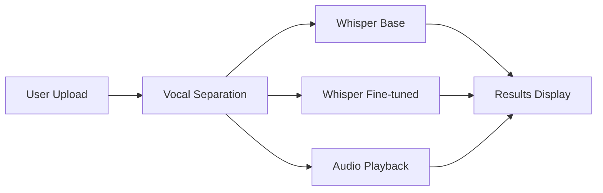
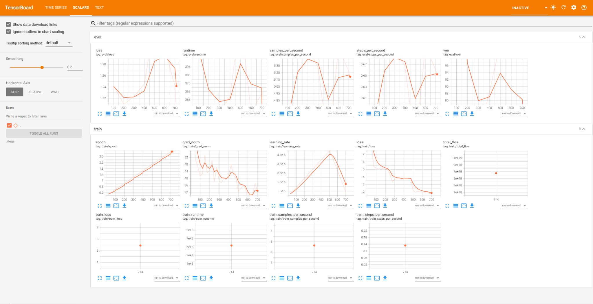

# 🎵 Lyrics Transcription & Vocal Separation - AI-Powered Song Lyrics Extraction

[](https://huggingface.co/spaces/MPH1155/ai-lyrics-transcription-demo)
[](https://github.com/MPH1155/ai-lyrics-transcription-demo)
[](LICENSE)

> **Fine-tuned OpenAI Whisper model with automatic vocal separation for accurate song lyrics transcription. Compare base vs. fine-tuned performance in real-time.**

🌐 **[View Static Demo Page](https://mph1155.github.io/ai-lyrics-transcription-demo/)** | 🚀 **[Try Live Demo on HF Spaces](https://huggingface.co/spaces/MPH1155/ai-lyrics-transcription-demo)**


## ✨ Features

- 🧠 **Fine-Tuned Whisper Model**: Custom-trained on 100+ song lyrics for superior music transcription accuracy
- 🎤 **Automatic Vocal Separation**: Isolates vocals using audio-separator before transcription
- 📊 **Side-by-Side Comparison**: View base Whisper vs. fine-tuned model outputs (segmented + full)
- 🎨 **Modern Web UI**: Clean Bootstrap 5 interface with audio playback
- ⚡ **FastAPI Backend**: Efficient async processing with CORS support
- 🐳 **Docker Ready**: Deploy anywhere with included Dockerfile

## 🎯 Quick Start

### Prerequisites
- Python 3.10+
- FFmpeg (for audio processing)
- 4GB+ RAM (8GB recommended)

### Local Setup
```bash
# Clone repository
git clone https://github.com/MPH1155/ai-lyrics-transcription-demo.git
cd ai-lyrics-transcription-demo

# Create virtual environment
python -m venv .venv
.venv\Scripts\activate  # Windows
# source .venv/bin/activate  # Linux/Mac

# Install dependencies
pip install -r requirements.txt

# Run the server
python -m uvicorn app:app --host 127.0.0.1 --port 8000

# Open http://127.0.0.1:8000 in your browser
```

## 📸 Screenshots

<table>
  <tr>
    <td></td>
    <td></td>
  </tr>
</table>

## 🏗️ Architecture



## 📊 Training & Evaluation Metrics

### Training Progress
Comprehensive training metrics including loss curves, learning rate schedules, and performance graphs are available in the [`graphs/`](graphs/) directory.



**Key Results:**
- **Base Whisper WER**: [145.58]%
- **Fine-Tuned WER**: [89.07]%
- **Improvement**: [56.51]%
- **Training Dataset**: 100+ song lyrics

For detailed metrics and interactive SVG graphs, see [graphs/README.md](graphs/README.md).

---

## 📁 Project Structure

```
ai-lyrics-transcription-demo/
├── app.py                      # Main FastAPI application
├── vocal_seperator.py          # Vocal separation logic
├── requirements.txt            # Python dependencies
├── Dockerfile                  # HF Space deployment
├── space.yml                   # HF Space configuration
├── src/
│   └── lyrics_asr/             # Core transcription package
│       ├── __init__.py
│       └── infer.py            # Inference functions
├── scripts/                    # Training & evaluation scripts
│   ├── training.py             # Fine-tuning script
│   ├── eval_with_HGFdata.py    # WER evaluation (public dataset)
│   ├── eval_with_full_song_data.py  # WER eval (custom dataset)
│   ├── create_dataset.py       # Dataset creation
│   ├── upload_dataset.py       # Upload to HF Hub
│   └── song_downloader.py      # YouTube audio downloader
├── graphs/                     # Training/eval visualizations
│   ├── train/                  # Training metrics (SVGs)
│   ├── eval/                   # Evaluation metrics (SVGs)
│   └── README.md               # Metrics documentation
├── docs/
│   ├── index.html              # GitHub Pages showcase
│   └── screenshots/            # UI screenshots
└── tests/                      # Unit tests
    ├── test_api.py
    └── test_infer.py
```

---

## 🔧 Advanced Usage

### Training the Model
```bash
cd scripts
python training.py
```
Outputs:
- Fine-tuned model: `./models/whisper-small-finetuned/`
- Training logs: `./logs/`
- Metrics graphs: `./graphs/train/`

### Evaluating Performance
```bash
# Evaluate on public dataset
python scripts/eval_with_HGFdata.py

# Evaluate on custom dataset
python scripts/eval_with_full_song_data.py
```

Results are saved as SVG graphs in `./graphs/eval/`.

### Environment Variables
Create a `.env` file (see `.env.example`):
```bash
FINETUNED_MODEL_ID=MPH1155/whisper-fine-tuned
HF_TOKEN=your_token_here  # Optional, for private models
```

---

## 5. Hugging Face Authentication
Do NOT hardcode tokens. Export environment variables instead:
```bash
# PowerShell
$Env:HUGGINGFACE_TOKEN = "hf_xxx"
```
Then inside Python:
```python
from huggingface_hub import login
import os
login(token=os.getenv("HUGGINGFACE_TOKEN"))
```

## 6. Training
```bash
python training.py
```
Outputs:
- Fine-tuned model directory: `./whisper-finetuned/`
- Logs in `./logs/`
- (Optional) Pushed model to Hub (configure push_to_hub)

## 7. Evaluation (WER)
Public dataset example:
```bash
python eval_with_HGFdata.py
```
Custom combined dataset example:
```bash
python eval_with_full_song_data.py
```

## 8. FastAPI Demo (Local)
```bash
uvicorn web_app:app --reload --port 8000
```
Open: http://localhost:8000

## 9. Deployment Options
### Option A: Hugging Face Spaces (Recommended for ML demo)
- Framework: Gradio or FastAPI Space
- Pros: GPU availability, simple model loading.
- Action: Wrap logic into a `app.py` Gradio interface or keep FastAPI and define `space_runtime.txt`.

### Option B: Vercel + Inference Backend
Vercel cannot run heavy GPU inference directly. Strategy:
1. Host inference API elsewhere (Render, HF Inference Endpoints, Replicate, or a lightweight EC2/GCP instance).
2. Create a separate `frontend/` (Next.js) deployed to Vercel.
3. Frontend calls backend REST endpoints: `/separate`, `/transcribe/base`, `/transcribe/fine`.
4. Optionally stream transcription progress via Server-Sent Events or websockets.

### Option C: All-in-one on a GPU VM
Use Docker + Nginx + systemd. Overkill for a portfolio demo unless you want DevOps credit.

## 10. Suggested Refactor (Target Structure)
```
.
├─ src/lyrics_asr/
│  ├─ __init__.py
│  ├─ data.py              # dataset prep / HF loading
│  ├─ train.py             # train entry (function)
│  ├─ eval.py              # compute WER
│  ├─ infer.py             # chunked transcription utilities
│  ├─ separate.py          # vocal separation wrapper
│  ├─ cli.py               # unified CLI (train/eval/infer)
│  └─ config.py            # load YAML config
├─ configs/
│  ├─ train.yaml
│  ├─ eval.yaml
│  └─ infer.yaml
├─ scripts/
│  ├─ download_dataset.ps1
│  └─ prepare_data.ps1
├─ tests/
│  ├─ test_infer.py
│  └─ fixtures/
```
Planned improvements: remove duplicated logic, centralize device selection, use argparse or Typer.

## 11. Security & Secrets
- Remove `huggingface_api.py` (currently contains a token!)
- Use `.env` with `python-dotenv` OR environment variables
- Never commit model weights if license forbids or they are large.

## 12. Roadmap
- [ ] Migrate scripts into `src/lyrics_asr`
- [ ] Introduce config-driven pipeline
- [ ] Add tests + CI workflow (GitHub Actions)
- [ ] Add small sample audio + smoke test
- [ ] Publish model + dataset cards on Hugging Face Hub
- [ ] Build Next.js frontend (optional) + deploy to Vercel
- [ ] Add Gradio demo for Spaces

## 13. Evaluation Metrics Snapshot (example)
| Model | WER (eval set) |
|-------|----------------|
| Base Whisper Small | 1.4558 |
| Fine-tuned | 0.8907 |
| Improvement | 0.5651 |

## 14. Contributing (Future)
Style: black + ruff
Tests: pytest
Environment: Python 3.10+

## 15. License
Choose a license (MIT recommended for portfolio) and add a `LICENSE` file.

---
Questions / feedback welcome. This README will evolve with the refactor.
