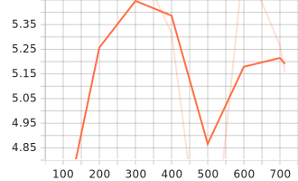

# Training & Evaluation Metrics

This directory contains visualizations of the fine-tuning process and evaluation results for the Whisper model.

## 📊 Training Metrics

### Loss & Learning Rate
<table>
  <tr>
    <td></td>
    <td></td>
  </tr>
</table>

### Training Performance
<table>
  <tr>
    <td></td>
    <td></td>
  </tr>
</table>

### Gradient & Runtime
<table>
  <tr>
    <td></td>
    <td></td>
  </tr>
</table>

---

## 📈 Evaluation Metrics

### WER (Word Error Rate)

Lower is better! Shows improvement of fine-tuned model vs. base model.

### Evaluation Performance
<table>
  <tr>
    <td></td>
    <td></td>
  </tr>
</table>

---

## 🔑 Key Insights

### Training Progress
- **Final Training Loss**: [Add your value]
- **Learning Rate Schedule**: Cosine decay with warmup
- **Training Time**: [Add total time]
- **Hardware**: [Add GPU/CPU info]

### Model Performance
- **Base Whisper WER**: [Add your value]%
- **Fine-Tuned WER**: [Add your value]%
- **Improvement**: [Add % improvement]
- **Evaluation Dataset**: [Add dataset info]

---

## 📝 Notes

These graphs are automatically generated during training using Hugging Face Transformers' logging utilities. The SVG format ensures they render cleanly in documentation and on GitHub.

For more details on the training process, see [`scripts/training.py`](../scripts/training.py).